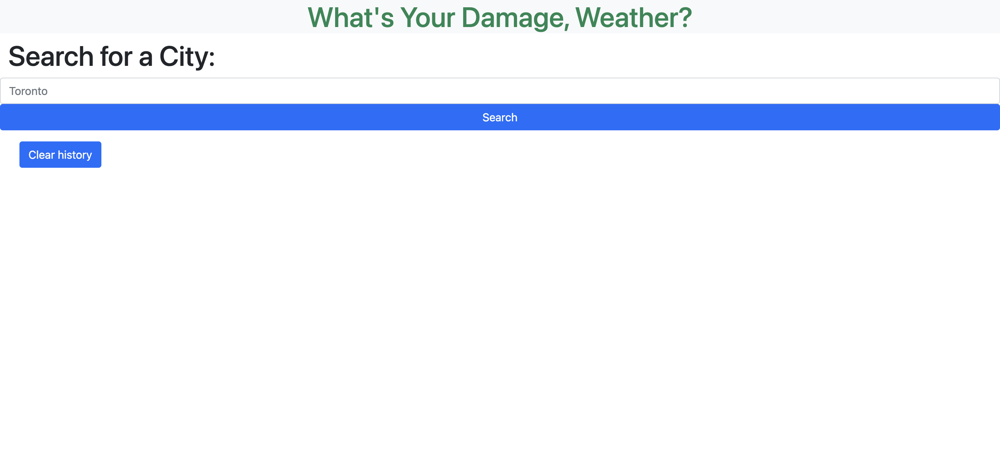
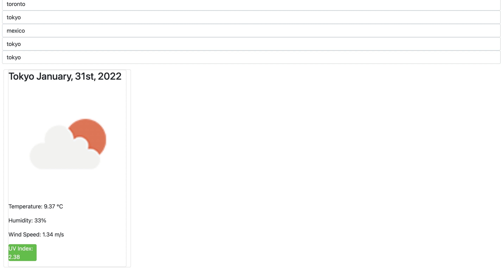
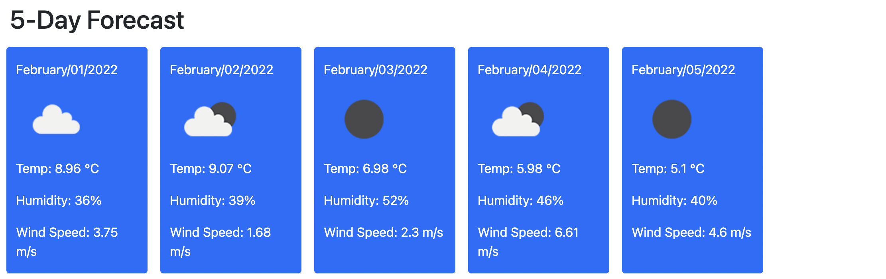

# weather-dashboard
a weather dashboard to assist in planning trips

## Description

I built this funcitonal weather dashboard to practice my skills with linking a web application to an API. It allows the user to search for weather conditions in any city while maintaining a search history that can be cleared with a button by the user. It will give temperature, wind speed, humidity, and UV index for the city searched. It also displays a 5 day forecast with an image for each day. 

I learned how to scrutinize the results and data of a fetch in order to organize it for rendering to the user. 

## Deployment

Deployed at: https://doshpocket.github.io/weather-dashboard/
GitHub: https://github.com/DoshPocket/weather-dashboard

## License
This build is licensed under Apache 2.0. (https://www.apache.org/licenses/LICENSE-2.0).
---
🏆 
## How to Contribute
Feel free to contribute further to my code within the standards of The [Contributor Covenant](https://www.contributor-covenant.org/). Happy coding!

